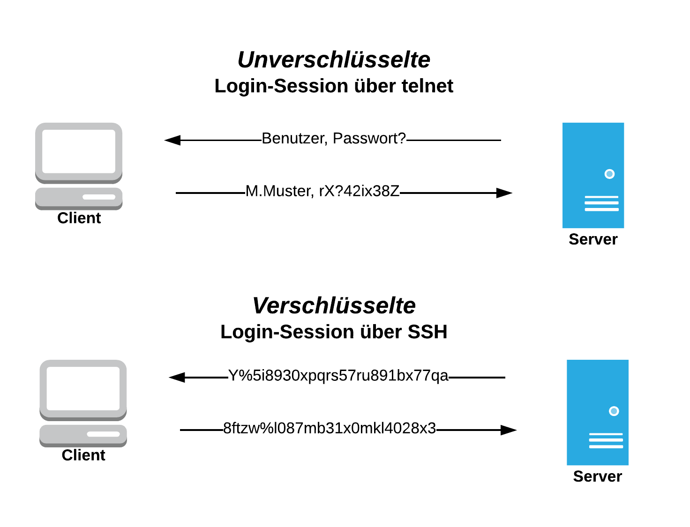
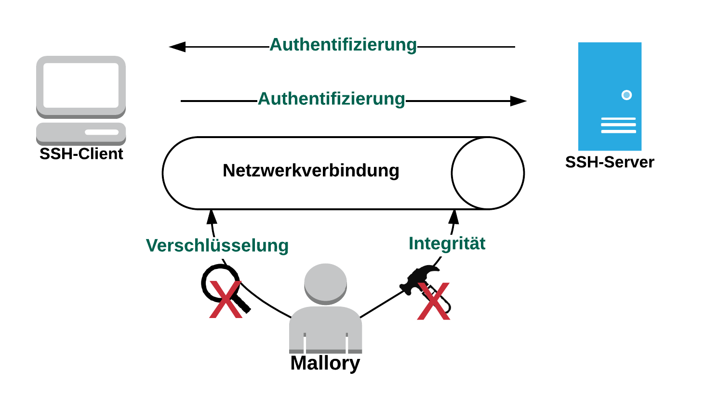

:title: SSH
:author: Susanne Kießling
:description: The Hovercraft! tutorial.
:keywords: presentation, backend, impress.js, hovercraft, yubikey
:css: presentation.css

----

.. utility roles

.. role:: underline
    :class: underline

.. role:: blocky
   :class: blocky

.. role:: tiny
   :class: tiny

.. role:: colored
   :class: colored

          
:id: first 

SSH - 
Secure Shell

:tiny:`Susanne Kießling (MIN)`

.. note::

   - note 

----

:blocky:`SSH - Old School?`

- Erste Version von 1995
- Lohnt sich näher damit zu beschäftigen !

.. note::
   - Note

.. image:: images/confused.png
   :align: center
   :height: 450px

----

:blocky:`Was Euch erwartet`

.. note::
   - note 

**Was ist SSH?**

**Grundprinzip von SSH**

**Protokolle: SSH-1, SSH-2**

**Elementare Funktionen (ssh, scp, sshfs)**

**Ablauf und Authentifizierung**

**SSH-Härtung**
  
----

:blocky:`Was ist SSH?`

- Secure Shell
- TCP/IP - Protokoll
- Hauptanwendung: Verschlüsselte Netzwerkverbindung zu einem entfernten Gerät
- Vorgänger: Telnet, RSH

.. note::
   - note

----

:blocky:`Telnet - SSH`

.. note::
   - note

----

:blocky:`Grundprinzip von SSH`

Sichere Kommunikation über ein Netzwerk durch:

- Verschlüsselung der Daten
- Integrität
- Authentifizierung

.. note::
   - note

----

:blocky:`SSH-1 und SSH-2`

**SSH-1:**

 + Entwickelt von Tatu Ylönen (University of Technology, Helsinki)
 + SSH1 (Implementierung) 1995 als Freie Software veröffentlicht
 + :colored:`--> nicht mehr empfohlen,` Schwachstellen in der Integritätsprüfung 
   wurden festgestellt (SSH-1 nutzt CRC)
 

.. note::
   - CRC=Cyclic redundancy check
   - HMAC= hash message authentication code

     
----

:blocky:`SSH-1 und SSH-2`

 
 **SSH-2:**

 + Sicherheitslücken von SSH-1 schließen
 + Statt CRC wird HMAC verwendet
 + Wahlmöglichkeit zwischen verschiedenen symmetrischen
   Verschlüsselungsverfahren
 + Zusätzliche Funktionen

.. note::
   - CRC=Cyclic redundancy check
   - HMAC= hash message authentication code

----

:blocky:`SSH-Implementierungen`

- OpenSSH
- Dropbear
- Mosh
- Lsh
- PuTTY

.. note::
   - Dropbear, MIT-Lizenz, Implementierung SSH2-Protokol,
     für Linux, Mac OS X, FreeBSD ...
   - Mosh: weitere Funktionalitäten, vorallem für mobile Nutzer,
     Verbindung wird bei Roaming aufrecht erhalten, optimierte Latenz (sofort
     zeigen, welche Befehle eingegeben wurden)
   - Lsh ebenfalls freie Impl. von SSH2-Protokoll, GPL
   - PuTTY, MIT-Lizenz, überwiegend für Windows

.. image:: images/openssh.gif
   :align: left
   :height: 200px

----

:blocky:`Let's start ... mit OpenSSH`

 - Installation: apt-get install openssh, dnf install opensshd
 - Kaum Konfiguration notwendig, näheres hierzu später
 - ssh (Client)
 - sshd (Server, d=daemon)
 
 **Im Folgenden:**

 - Blick in die manpages von OpenSSH
 - Server-Config

.. note::
   - note 

----

:blocky:`Remote Terminal Session`

Client --> Server in lokalem Netzwerk

.. code-block:: bash  
   
   [sue@kaktus]$ ssh qitta@hitomi
   qitta@hitomi's password: 
   Last login: Fri Apr 22 21:24:20 2016 from 192.168.23.20
   ~ ❯ 

Client --> Server unterschiedliche Netzwerke

.. code-block:: bash

   [sue@kaktus]$ ssh micra@login.rz.hs-augsburg.de
   micra@login.rz.hs-augsburg.de's password:
   Linux bug 3.2.0-4-amd64 #1 SMP Debian 3.2.65-1+deb7u1 x86_64
   Plan your installation, and FAI installs your plan.
   
   Last login: Mon Apr 25 22:38:45 2016 
   from p5088ff5b.dip0.t-ipconnect.de 
   micra@bug:~$ 

.. note::
   - note

----

:blocky:`Datenübertragung mit scp`

.. code-block:: bash  
  
   [sue@kaktus ~]$ scp letter.pdf qitta@hitomi:~
   qitta@hitomi's password:
   letter.pdf                 100% 6297     6.2KB/s   00:00

.. note::
   - note

----

:blocky:`sshfs - Dateisystem einhängen`

- Secure Shell File System
- Ermöglicht, entferntes Dateisystem per SSH einzuhängen
- FUSE basierend (Filesystem in User Space)

- Mounting: sshfs [user@]host:[dir] mountpoint [options]
- Unmounting: fusermount -u mountpoint

.. code-block:: bash  

    [sue@kaktus ~]$ sshfs micra@login.rz.hs-augsburg.de:
    /rz2home/micra/Dokumente mount_rz
    micra@login.rz.hs-augsburg.de's password:

    [sue@kaktus ~]$ fusermount -u ~/mount_rz

.. note::
   - note

----

:blocky:`Grober Ablauf`

1. Client sendet Anfrage an Server (Port 22)
2. Server gibt seine Identität, verwendetes Protokoll etc. bekannt
3. Client erhält Warnung, falls er das erste Mal mit Server kommuniziert
   --> Eintrag der Host-ID in known_hosts
4. Erzeugung eines Session-Keys mit Diffie-Hellman Schlüsseltausch
   (Stichwort: Forward Secrunity)
5. Client wählt eine der vorgeschlagenen symmetrischen Verschlüsselungen (AES, Blowfish, 3DES, ...)

----

:blocky:`Authentifizierung`

**Bisher:** Benutzername und Passwort 
**Empfehlenswert:** Public-Key-Authentifizierung

 - Schlüsselpaar, bestehend aus privatem + öffentlichem Schlüssel
 - Server generiert Zufalls-String (256bit) mit öffentlichem Schlüssel
 - Client entschlüsselt String mit privatem Schlüssel
 - Client kombiniert String mit Session-Key und generiert daraus eine
   md5-Hashsumme
 - Server führt dies ebenfalls durch und vergleicht md5-Summe
 - Abgleich okay --> Client authentifiziert

.. note::
   - Um nur einen Grund zu nennen: Anforderungen an sicheres Passwort werden oft nicht eingehalten bzw.
     Passwörter mit hoher Entropie sind häufig schwer zu merken

----

:blocky:`Port Forwarding`

- Verschlüsselung von Datenströmen anderer TCP-Andwendungen
- Wird auch Tunneling genannt

:blocky:`X Forwarding`

- X-Window von Remote-Rechner erscheint auf Client

.. note::
   - note

----

:blocky:`SSH härten`

- Grundkonfiguration auf manchen Systemen nur bedingt sinnvoll/sicher
- In Config abzuändern:

  - PermitRootLogin no
  - AllowedUsers UserA, Userb
  - Evtl. Port von 22 auf XY setzen, um Skriptkiddie-Attacken ins Leere laufen
    zu lassen
  - XForwarding deaktivieren
  - SSH Protokoll 2
  - Authentifizierung: Von Password auf Public Key umstellen

  
.. note::
  - Das sollte für den Großteil der Anwender ausreichend sicher sein.

----

:blocky:`Why 2F authentication`

+ Weak passwords
+ Even strong passwords can be leaked by service
+ The number of passwords to remember grows

---------------------

**Vielen Dank ... und nutzt SSH ;-)**

