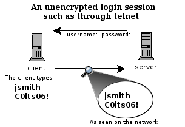
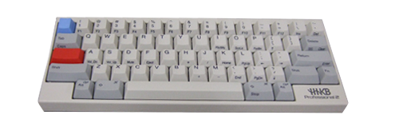
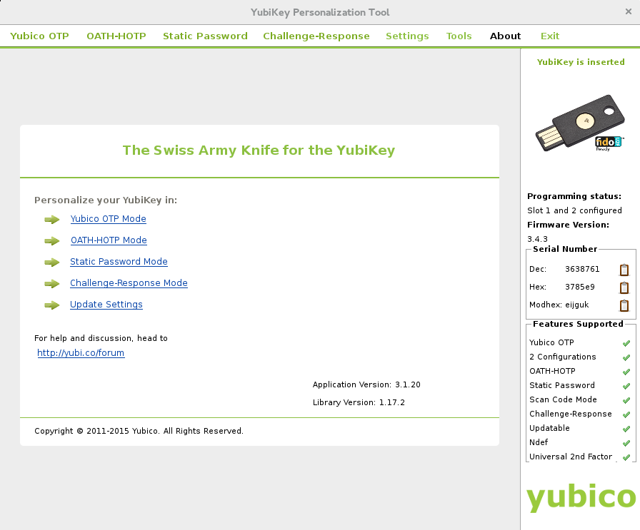

:title: SSH
:author: Susanne Kießling
:description: The Hovercraft! tutorial.
:keywords: presentation, backend, impress.js, hovercraft, yubikey
:css: presentation.css

----

.. utility roles

.. role:: underline
    :class: underline

.. role:: blocky
   :class: blocky

.. role:: tiny
   :class: tiny

           
:id: first 

SSH - 
Secure Shell

:tiny:`Susanne Kießling`

.. note::

   - I would like to give you an introduction to YubiKey

----

:blocky:`SSH - Old School?`

- Erste Version von 1995
- Lohnt sich näher damit zu beschäftigen !

.. note::
   - Note

.. image:: images/confused.png
   :align: center
   :height: 450px

----

:blocky:`Was Euch erwartet`

.. note::
   - note 

**Was ist SSH?**
  + Grundprinzip von SSH
  + Kryptografie
**Elementare Funktionen**
  Remote
**More on SSH**
  Key on YubiKey
  
** Anwendungsbeispiele**

----

:blocky:`Was ist SSH?`

- SSH = Secure Shell
- TCP/IP - Protokoll
- Hauptanwendung: Verschlüsselte Netzwerkverbindung zu einem entfernten Gerät
- Vorgänger: Telnet, RSH

.. note::
   - note
  
----

:blocky:`Grundprinzip von SSH`

.. note::
   - note

.. image:: images/ssh_prinzip.png
   :align: right
   :height: 400px

           
----

:blocky:`Why 2F authentication`

+ Weak passwords
+ Even strong passwords can be leaked by service
+ The number of passwords to remember grows

.. note::
   - weak passwords: easy to crack by Brute Force, with dictionary attack
   - strong passwords, which means passwords with high entropy, are also
     saved on the services server you are logged in to, and it can be leaked

   - Number of passwords grows: maybe you use a password manager, but
     also the access to password manager needs to be protected

------

:blocky:`From outside`

+ No removable parts
+ Hermetically sealed plastic
+ Almost indestructible

.. note::   
   - very lightweight device
   - solid-state capacitive touch sensor

------

:blocky:`How it works`

.. note::   
   - There are 2 slots which can be configured 
      

+ Slot 1: Short press 0.3 - 1.5 seconds
+ Slot 2: Long press 2.5 seconds - 5 seconds

------

:blocky:`Basic Concept`

+ Platform independent: Linux, Mac OS X, Windows
+ OpenSource, code hosted on https://github.com/Yubico
+ Acts like standard USB keyboard 
+ --> No additional drivers required
+ --> No battery needed

.. note::
  - HID (Human Interface Device)

------

    :blocky:`Functions and Features`

**One time password (OTP)**
  e.g. Login to online services with 2FA
**Static password**
  e.g. System-Login, services without 2FA  
**Open PGP**
  Store your OpenPGP Keys

**Near Field Communication (NFC)**

.. note::
   - that's only a part of all functions, which YubiKey offers 
     the most interesting
   
------

:blocky:`Usage Demonstration`

    1. Output Demonstration: one-time password, static password
    2. Login to GitHub with two-factor authentication

.. note::
   -  before telling more details, i will demonstrate
      what happens if I touch the button of YubiKey
   -  Slot 1 is configured with OTP - short press
   -  next: login to GitHub, pretty simple
 
------

:blocky:`YubiKey OTP`

.. note:: 
   -  it shows a simple representation of OTP function
   -  YubiKey OTP is a 44 character string
   -  128-bit encrypted, with AES (Advanced Encr. Standard), symmetric-key
      algorithm
   -  two major parts
   -  first 12 characters is the YubiKey-Id, it identifies the YubiKey and does
      not change
   -  remaining 32 chars, that's the encrypted passcode
   -  it consists of maltitude factors: Counter, Timestamp, Random
      number, checksum
   

  

-----

:blocky:`Secure Static Password`

  - Not as secure as one-time passwords
  - 16 to 64 characters/numbers
  - Often used with additional manually entered part of password

 

-----

:blocky:`OpenPGP`

+ Pretty Good Privacy(PGP), open standard
+ Encrypt E-Mails, Digital Signature, Authentication
+ Store your keys on YubiKey (smartcard)

.. note::
   - for whom of you, using OpenPGP 
   - private key can not be stolen from PC
   
-----

:blocky:`Configuration`

.. note::
   - the YubiKey Personalization Tool
   - shows which slots are configured
   - shows which functions are supported

-----

:blocky:`Where to use`

+ Online Services
   e.g.  GitHub, Dropbox, GoogleAccounts (U2F)
+ Password Management
   e.g. KeePass, LastPass
+ System Login
+ Disk Encryption

and many more

.. image:: images/github.svg
   :align: left
   :width: 15%

.. image:: images/dropbox.png
   :align: center
   :width: 15%

.. image:: images/google3.png
   :align: left
   :width: 15%

.. note::
   - protect your online-identity    
   - Extra layer of security for logging in to the password manager
   - Show how easy it works, Login to github with two-factor auth
   - U2F is an open authentication standard, hosted by the open-authentication
     industry consortium FIDO Alliance, it enables internet users  to
     securely access any number of online services

--------------------

:blocky:`YubiKey versions`

.. image:: images/versions.png
   :align: center
   :width: 120%

.. note::
   - Since the first version of YubiKey (Standard), there came up     
     some additional functions and security improvements
   - YubiKey4(PGP): YubiKey 4 introduces a new touch feature that allows to protect
     the use of the private keys with an additional layer.
   - COSTS: YubiKey Neo 50 EUR, Standard+Edge 30 EUR, FIDO 15 EUR
   - FIDO is special version, with primary function Fido U2F (Universal sec.
     factor)

--------------------

:blocky:`YubiKey Nano`

.. note::
   - fits exactly in USB-port
   - usefull for laptops, which you carry around

-----

:blocky:`For Business`

**Challenge: Protect data and systems**

+ Securing identity of employees
+ Securing access to accounts and systems
+ Securing code development, data of employees
+ Securing Mobile Devices

.. note::
   - As we heard yesterday, it's a challenge for enterprises to protect
     their data e.g. if mobile devices get lost
   - you know with YubiKey it need both: password and physical device

------------------

:blocky:`Enterprises using YubiKey`

+ **Google**, uses  YubiKey NEO for all employees
+ **GitHub** offers U2F for all developers
+ **Cern**,the European Organization for Nuclear Research,
  uses YubiKeys for securing critical services

.. note::
   - Three examples of enterprises which use YubiKey

---------------------

:blocky:`All in all`

+ Simple to use
+ Code is OpenSource, allows scrunity
+ Powerfull functions

**A pretty smart device to improve data security...
and additional to have a cool fashion accessories.**

.. note::
  - simple to use
  - good usability
  - Code is OpenSource, allows scrutiny(genaue Prüfung)
  - if it's important for you to protect your online identity,
    and access to your data in general,
    maybe it might be worth considering to use the YubiKey

---------------------

**Are there any questions?**

.. note::
    - get lost: Recovery codes, backups
